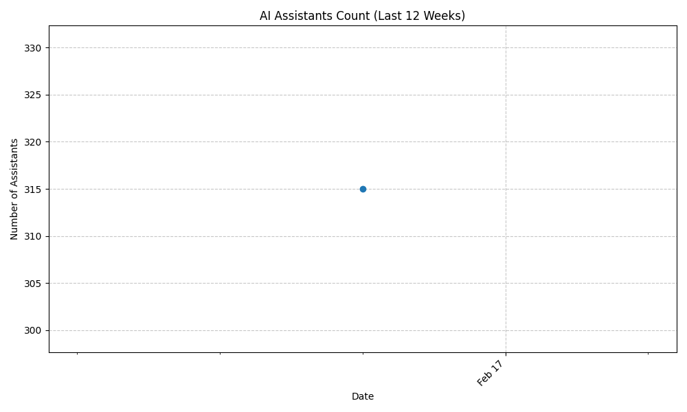

# AI Assistants Collection




This repository contains an extensive collection of AI assistant configurations organized by category. Each assistant is configured using YAML files that contain system prompts and relevant settings. While these configurations are not directly importable into platforms like Open Web UI or Dify, they provide well-structured system prompts that can be applied to various AI models.

The assistants are organized into specialized categories including:

- Business Strategy
- Career Developmentvv
- Chat Characters
- Content Creation
- Data Analysis
- Development Tools
- Docker Management
- Education
- Entertainment
- Technical Documentation
- Workflow Automation
 
## Assistant Index

[View the complete alphabetical index of all assistants](index.md)

## Collection Status

This is an actively maintained collection of AI assistant configurations. Each assistant is carefully crafted to serve specific use cases, from practical business applications to creative and entertainment purposes. Some configurations may require specific capabilities (like vision or voice) or additional tools (RAG pipelines, external APIs) that are not included in the base configuration.

## Usage

Feel free to use these configurations in your AI platforms and projects. While many configurations will work by simply applying the system prompt to a compatible model, some may require additional setup or specific model capabilities.

## Configuration Format

Here's an example of how assistants are configured:

```yaml
created_date: '2025-02-14 03:12:53'
title: Company background research helper
base_model_id: google/gemini-2.0-flash-001
temperature: null
description: Researches and compiles comprehensive background reports on companies,
  covering aspects such as their history, operations, key personnel, financial performance,
  and recent news. It synthesizes information from various public sources to provide
  a structured overview.
system_prompt: 'Your purpose is to conduct background research on a company for the
  user, providing a comprehensive overview of its operations, history, and current
  standing.'
```

| Parameter | Description |
|-----------|-------------|
| created_date | The timestamp when the assistant configuration was created |
| title | The name of the assistant that describes its primary function |
| base_model_id | The identifier of the underlying AI model to be used |
| temperature | The sampling temperature for the model's output (null means use model default) |
| description | A detailed explanation of the assistant's capabilities and purpose |
| system_prompt | The core instructions that define the assistant's behavior and role |

## License

These configurations are freely available for use. While attribution is not required, it is appreciated when these configurations are shared or redistributed.

 ---


## Author

Daniel Rosehill  
(public at danielrosehill dot com)

## Licensing

This repository is licensed under CC-BY-4.0 (Attribution 4.0 International) 
[License](https://creativecommons.org/licenses/by/4.0/)

### Summary of the License
The Creative Commons Attribution 4.0 International (CC BY 4.0) license allows others to:
- **Share**: Copy and redistribute the material in any medium or format.
- **Adapt**: Remix, transform, and build upon the material for any purpose, even commercially.

The licensor cannot revoke these freedoms as long as you follow the license terms.

#### License Terms
- **Attribution**: You must give appropriate credit, provide a link to the license, and indicate if changes were made. You may do so in any reasonable manner, but not in any way that suggests the licensor endorses you or your use.
- **No additional restrictions**: You may not apply legal terms or technological measures that legally restrict others from doing anything the license permits.

For the full legal code, please visit the [Creative Commons website](https://creativecommons.org/licenses/by/4.0/legalcode).